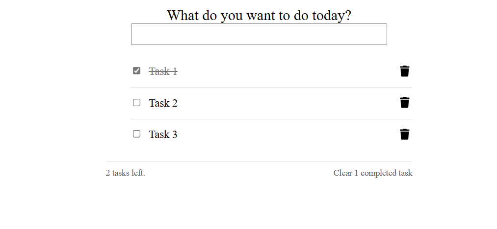

## Visulization of App



## Getting Started with the App
```bash
cd frontend

npm install

npm start
```

After this ,Open localhost:3000 to see the todo list UI.

```bash
cd backend

npm install

npm start
```


you can see 

```yml
Server is running on port 4000 ( The backend server is running on 4000 port)
Connected to SQLite database
```

A new file is created named test.db if you run 1st time. Which stores the todo list data using sqlite3


Features:

- Add a task to their to-do list
- Mark a task as done using a checkbox
- Delete a task, whether it’s done or not, using a ‘delete’ icon on the right side of the task.
- See a count of undone tasks.
- Delete all ‘done’ tasks from icon


## DB checking for more info:
Open command prompt and do 

```bash
sqlite3 test.db
.databases
select * from tasks;
```

you can see list of todo stored in db file test.db